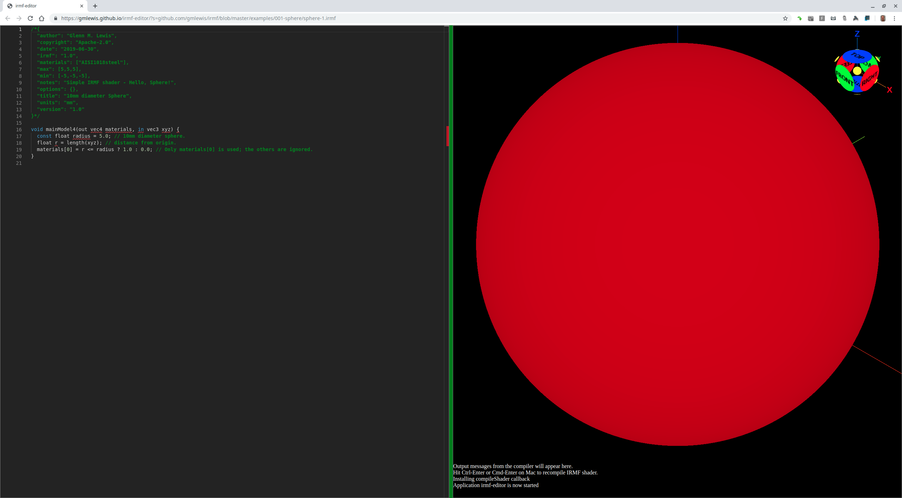
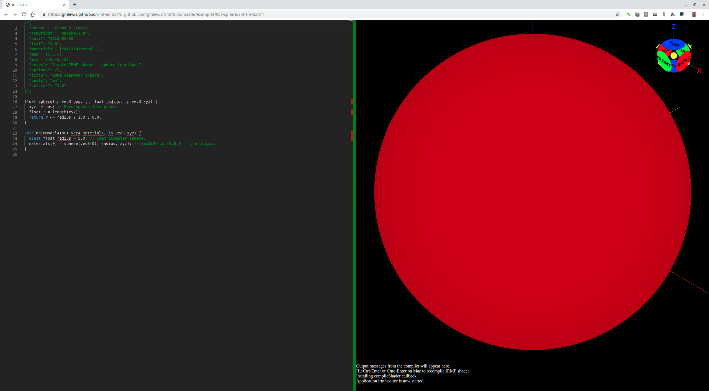
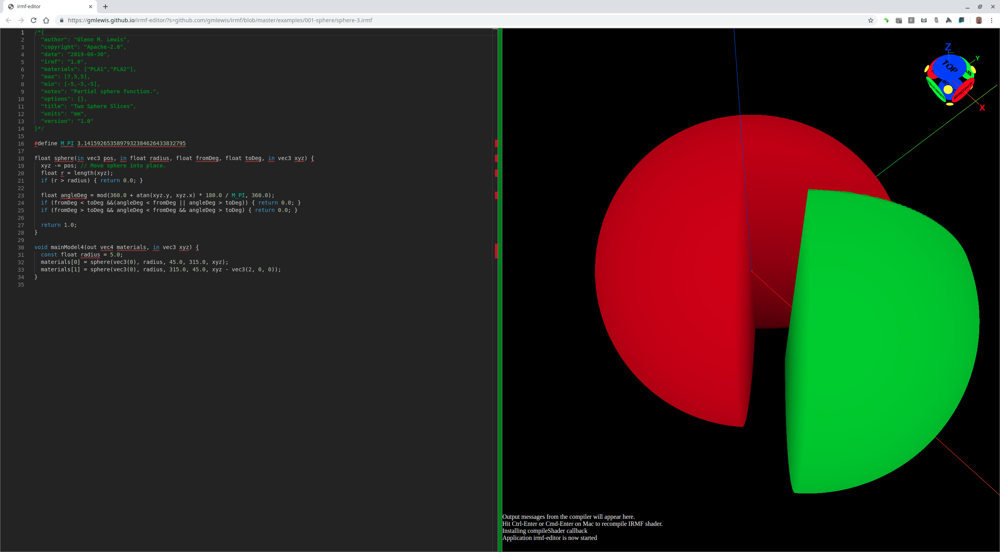

# 001-sphere (ball bearing)

One of the most notoriously-difficult objects to model and create using additive manufacturing
is the perfectly-smooth sphere (*e.g.* a ball bearing, or actually any smooth, curved surface).
STL (a triangle-based representation) is simply the wrong tool for the job.
Not even do voxels solve the problem due to their finite image resolution.

Yet, ironically, the perfect sphere is almost the easiest thing to model using an IRMF shader.

## sphere-1.irmf

Here is an [IRMF shader](sphere-1.irmf) defining a 10mm diameter sphere:



```glsl
/*{
  irmf: "1.0",
  materials: ["AISI 1018 steel"],
  max: [5,5,5],
  min: [-5,-5,-5],
  units: "mm",
}*/

void mainModel4(out vec4 materials, in vec3 xyz) {
  const float radius = 5.0; // 10mm diameter sphere.
  float r = length(xyz); // distance from origin.
  materials[0] = r <= radius ? 1.0 : 0.0; // Only materials[0] is used; the others are ignored.
}
```

* Try loading [sphere-1.irmf](https://gmlewis.github.io/irmf-editor/?s=github.com/gmlewis/irmf/blob/master/examples/001-sphere/sphere-1.irmf) now in the experimental IRMF editor!

* Here is a crude STL approximation of this model
  using [irmf-slicer](https://github.com/gmlewis/irmf-slicer):
  - [sphere-1-mat01-AISI-1018-steel.stl](sphere-1-mat01-AISI-1018-steel.stl) (26712884 bytes)

## sphere-2.irmf

`sphere-1.irmf` above is fine if your entire model is a sphere, but is not
terribly useful if you would like to make a more complex model out of
one or more spheres. Let's make a `sphere` function that is reusable.



```glsl
/*{
  irmf: "1.0",
  materials: ["AISI 1018 steel"],
  max: [5,5,5],
  min: [-5,-5,-5],
  units: "mm",
}*/

float sphere(in vec3 pos, in float radius, in vec3 xyz) {
  xyz -= pos; // Move sphere into place.
  float r = length(xyz);
  return r <= radius ? 1.0 : 0.0;
}

void mainModel4(out vec4 materials, in vec3 xyz) {
  const float radius = 5.0; // 10mm diameter sphere.
  materials[0] = sphere(vec3(0), radius, xyz); // vec3(0) is [0,0,0] - the origin.
}
```

* Try loading [sphere-2.irmf](https://gmlewis.github.io/irmf-editor/?s=github.com/gmlewis/irmf/blob/master/examples/001-sphere/sphere-2.irmf) now in the experimental IRMF editor!

* Here is a crude STL approximation of this model
  using [irmf-slicer](https://github.com/gmlewis/irmf-slicer):
  - [sphere-2-mat01-AISI-1018-steel.stl](sphere-2-mat01-AISI-1018-steel.stl) (26712884 bytes)

## sphere-3.irmf

Sometimes you just want a slice of a sphere, and I find it easier to think
in terms of degrees when sectioning things with a 'from' and 'to', so I
made the parameters degrees in this case.



```glsl
/*{
  irmf: "1.0",
  materials: ["PLA1","PLA2"],
  max: [7,5,5],
  min: [-5,-5,-5],
  units: "mm",
}*/

#define M_PI 3.1415926535897932384626433832795

float sphere(in vec3 pos, in float radius, float fromDeg, float toDeg, in vec3 xyz) {
  xyz -= pos; // Move sphere into place.
  float r = length(xyz);
  if (r > radius) { return 0.0; }
  
  float angleDeg = mod(360.0 + atan(xyz.y, xyz.x) * 180.0 / M_PI, 360.0);
  if (fromDeg < toDeg &&(angleDeg < fromDeg || angleDeg > toDeg)) { return 0.0; }
  if (fromDeg > toDeg && angleDeg < fromDeg && angleDeg > toDeg) { return 0.0; }
  
  return 1.0;
}

void mainModel4(out vec4 materials, in vec3 xyz) {
  const float radius = 5.0;
  materials[0] = sphere(vec3(0), radius, 45.0, 315.0, xyz);
  materials[1] = sphere(vec3(0), radius, 315.0, 45.0, xyz - vec3(2, 0, 0));
}
```

* Try loading [sphere-3.irmf](https://gmlewis.github.io/irmf-editor/?s=github.com/gmlewis/irmf/blob/master/examples/001-sphere/sphere-3.irmf) now in the experimental IRMF editor!

* Here is a crude STL approximation of this model
  using [irmf-slicer](https://github.com/gmlewis/irmf-slicer)
  (one STL file per material):
  - [sphere-3-mat01-PLA1.stl](sphere-3-mat01-PLA1.stl) (26304884 bytes)
  - [sphere-3-mat02-PLA2.stl](sphere-3-mat02-PLA2.stl) (12982884 bytes)

----------------------------------------------------------------------

# License

Copyright 2019 Glenn M. Lewis. All Rights Reserved.

Licensed under the Apache License, Version 2.0 (the "License");
you may not use this file except in compliance with the License.
You may obtain a copy of the License at

    http://www.apache.org/licenses/LICENSE-2.0

Unless required by applicable law or agreed to in writing, software
distributed under the License is distributed on an "AS IS" BASIS,
WITHOUT WARRANTIES OR CONDITIONS OF ANY KIND, either express or implied.
See the License for the specific language governing permissions and
limitations under the License.
