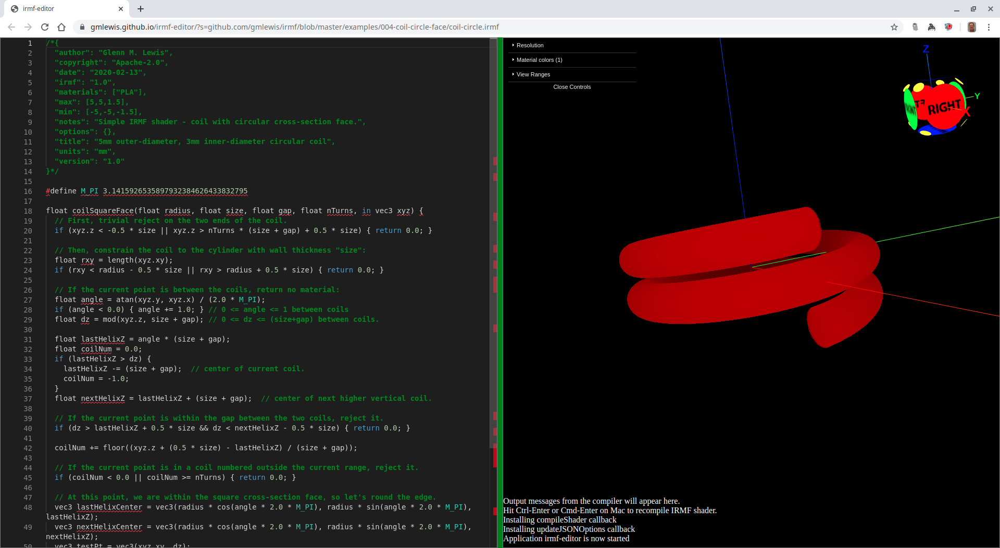

# 004-coil-circle-face

## coil-circle.irmf

Once the square-face helical coil was done, it is a rather simple matter
to round the edges.



```glsl
/*{
  irmf: "1.0",
  materials: ["PLA"],
  max: [5,5,1.5],
  min: [-5,-5,-1.5],
  units: "mm",
}*/

#define M_PI 3.1415926535897932384626433832795

float coilSquareFace(float radius, float size, float gap, float nTurns, in vec3 xyz) {
  // First, trivial reject on the two ends of the coil.
  if (xyz.z < -0.5 * size || xyz.z > nTurns * (size + gap) + 0.5 * size) { return 0.0; }
  
  // Then, constrain the coil to the cylinder with wall thickness "size":
  float rxy = length(xyz.xy);
  if (rxy < radius - 0.5 * size || rxy > radius + 0.5 * size) { return 0.0; }
  
  // If the current point is between the coils, return no material:
  float angle = atan(xyz.y, xyz.x) / (2.0 * M_PI);
  if (angle < 0.0) { angle += 1.0; } // 0 <= angle <= 1 between coils
  float dz = mod(xyz.z, size + gap); // 0 <= dz <= (size+gap) between coils.
  
  float lastHelixZ = angle * (size + gap);
  float coilNum = 0.0;
  if (lastHelixZ > dz) {
    lastHelixZ -= (size + gap);  // center of current coil.
    coilNum = -1.0;
  }
  float nextHelixZ = lastHelixZ + (size + gap);  // center of next higher vertical coil.
  
  // If the current point is within the gap between the two coils, reject it.
  if (dz > lastHelixZ + 0.5 * size && dz < nextHelixZ - 0.5 * size) { return 0.0; }
  
  coilNum += floor((xyz.z + (0.5 * size) - lastHelixZ) / (size + gap));

  // If the current point is in a coil numbered outside the current range, reject it.
  if (coilNum < 0.0 || coilNum >= nTurns) { return 0.0; }
  
  // At this point, we are within the square cross-section face, so let's round the edge.
  vec3 lastHelixCenter = vec3(radius * cos(angle * 2.0 * M_PI), radius * sin(angle * 2.0 * M_PI), lastHelixZ);
  vec3 nextHelixCenter = vec3(radius * cos(angle * 2.0 * M_PI), radius * sin(angle * 2.0 * M_PI), nextHelixZ);
  vec3 testPt = vec3(xyz.xy, dz);
  float r1 = length(testPt - lastHelixCenter);
  float r2 = length(testPt - nextHelixCenter);
  if (r1 > 0.5 * size && r2 > 0.5 * size) { return 0.0; }
  
  return 1.0;
}

void mainModel4(out vec4 materials, in vec3 xyz) {
  xyz.z += 1.0;
  materials[0] = coilSquareFace(3.0, 0.85, 0.15, 2.0, xyz);
}
```

* Try loading [coil-circle.irmf](https://gmlewis.github.io/irmf-editor/?s=github.com/gmlewis/irmf/blob/master/examples/004-coil-circle-face/coil-circle.irmf) now in the experimental IRMF editor!

----------------------------------------------------------------------

# License

Copyright 2019 Glenn M. Lewis. All Rights Reserved.

Licensed under the Apache License, Version 2.0 (the "License");
you may not use this file except in compliance with the License.
You may obtain a copy of the License at

    http://www.apache.org/licenses/LICENSE-2.0

Unless required by applicable law or agreed to in writing, software
distributed under the License is distributed on an "AS IS" BASIS,
WITHOUT WARRANTIES OR CONDITIONS OF ANY KIND, either express or implied.
See the License for the specific language governing permissions and
limitations under the License.
