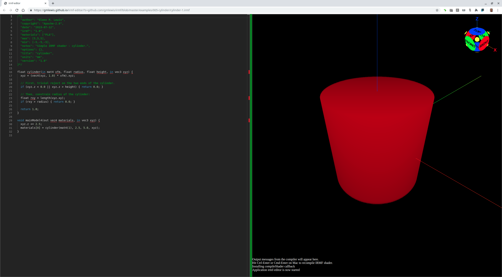

# 005-cylinder

## cylinder-1.irmf

It is time to make some Platonic solids for building blocks.



```glsl
/*{
  irmf: "1.0",
  materials: ["PLA"],
  max: [5,5,5],
  min: [-5,-5,-5],
  units: "mm",
}*/

float cylinder(in mat4 xfm, float radius, float height, in vec3 xyz) {
  xyz = (vec4(xyz, 1.0) * xfm).xyz;
  
  // First, trivial reject on the two ends of the cylinder.
  if (xyz.z < 0.0 || xyz.z > height) { return 0.0; }
  
  // Then, constrain radius of the cylinder:
  float rxy = length(xyz.xy);
  if (rxy > radius) { return 0.0; }
  
  return 1.0;
}

void mainModel4(out vec4 materials, in vec3 xyz) {
  xyz.z += 2.5;
  materials[0] = cylinder(mat4(1), 2.5, 5.0, xyz);
}
```

* Try loading [cylinder-1.irmf](https://gmlewis.github.io/irmf-editor/?s=github.com/gmlewis/irmf/blob/master/examples/005-cylinder/cylinder-1.irmf) now in the experimental IRMF editor!

----------------------------------------------------------------------

# License

Copyright 2019 Glenn M. Lewis. All Rights Reserved.

Licensed under the Apache License, Version 2.0 (the "License");
you may not use this file except in compliance with the License.
You may obtain a copy of the License at

    http://www.apache.org/licenses/LICENSE-2.0

Unless required by applicable law or agreed to in writing, software
distributed under the License is distributed on an "AS IS" BASIS,
WITHOUT WARRANTIES OR CONDITIONS OF ANY KIND, either express or implied.
See the License for the specific language governing permissions and
limitations under the License.
