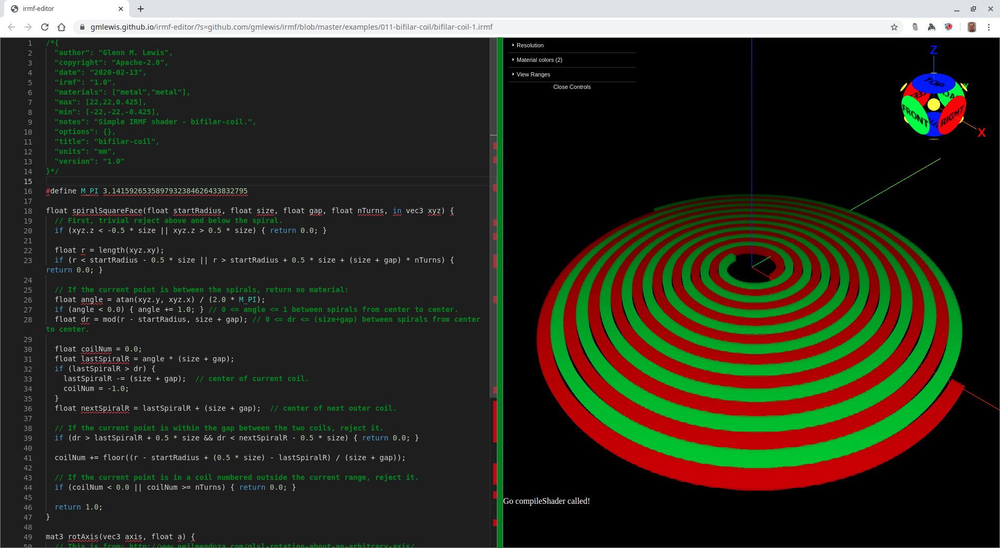
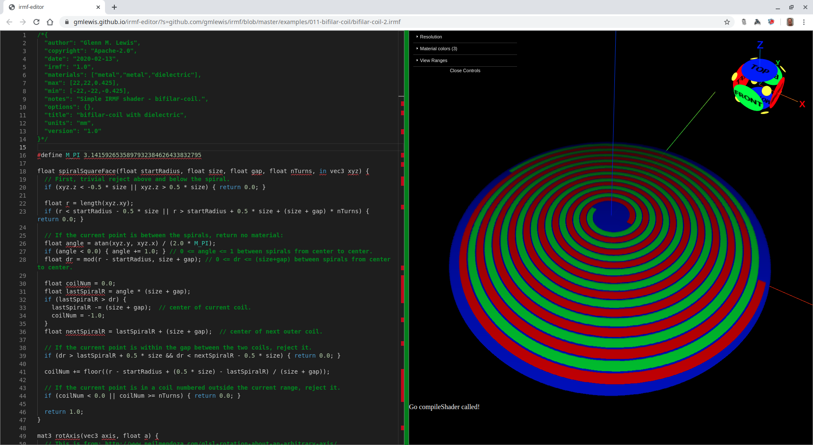

# 011-bifilar-coil

## bifilar-coil-1.irmf

Another surprisingly-simple model is a bifilar-coil which is two spirals.



```glsl
/*{
  irmf: "1.0",
  materials: ["copper","copper"],
  max: [22,22,0.425],
  min: [-22,-22,-0.425],
  units: "mm",
}*/

#define M_PI 3.1415926535897932384626433832795

float spiralSquareFace(float startRadius, float size, float gap, float nTurns, in vec3 xyz) {
  // First, trivial reject above and below the spiral.
  if (xyz.z < -0.5 * size || xyz.z > 0.5 * size) { return 0.0; }
  
  float r = length(xyz.xy);
  if (r < startRadius - 0.5 * size || r > startRadius + 0.5 * size + (size + gap) * nTurns) { return 0.0; }
  
  // If the current point is between the spirals, return no material:
  float angle = atan(xyz.y, xyz.x) / (2.0 * M_PI);
  if (angle < 0.0) { angle += 1.0; } // 0 <= angle <= 1 between spirals from center to center.
  float dr = mod(r - startRadius, size + gap); // 0 <= dr <= (size+gap) between spirals from center to center.
  
  float coilNum = 0.0;
  float lastSpiralR = angle * (size + gap);
  if (lastSpiralR > dr) {
    lastSpiralR -= (size + gap);  // center of current coil.
    coilNum = -1.0;
  }
  float nextSpiralR = lastSpiralR + (size + gap);  // center of next outer coil.
  
  // If the current point is within the gap between the two coils, reject it.
  if (dr > lastSpiralR + 0.5 * size && dr < nextSpiralR - 0.5 * size) { return 0.0; }
  
  coilNum += floor((r - startRadius + (0.5 * size) - lastSpiralR) / (size + gap));

  // If the current point is in a coil numbered outside the current range, reject it.
  if (coilNum < 0.0 || coilNum >= nTurns) { return 0.0; }

  return 1.0;
}

mat3 rotAxis(vec3 axis, float a) {
  // This is from: http://www.neilmendoza.com/glsl-rotation-about-an-arbitrary-axis/
  float s = sin(a);
  float c = cos(a);
  float oc = 1.0 - c;
  vec3 as = axis * s;
  mat3 p = mat3(axis.x * axis, axis.y * axis, axis.z * axis);
  mat3 q = mat3(c, - as.z, as.y, as.z, c, - as.x, - as.y, as.x, c);
  return p * oc + q;
}

vec2 bifilarCoil(float startRadius, float size, float gap, float nTurns, in vec3 xyz) {
  float coil1 = spiralSquareFace(startRadius, size, (size + 2.0 * gap), nTurns, xyz);
  mat4 rot180Z = mat4(rotAxis(vec3(0, 0, 1), M_PI));
  xyz = (vec4(xyz, 1.0) * rot180Z).xyz;
  float coil2 = spiralSquareFace(startRadius, size, (size + 2.0 * gap), nTurns, xyz);
  return vec2(coil1, coil2);
}

void mainModel4(out vec4 materials, in vec3 xyz) {
  materials.xy = bifilarCoil(3.0, 0.85, 0.15, 9.0, xyz);
}
```

* Try loading [bifilar-coil-1.irmf](https://gmlewis.github.io/irmf-editor/?s=github.com/gmlewis/irmf/blob/master/examples/011-bifilar-coil/bifilar-coil-1.irmf) now in the experimental IRMF editor!

* Here is a crude STL approximation of this model
  using [irmf-slicer](https://github.com/gmlewis/irmf-slicer)
  (one STL file per material):
  - [bifilar-coil-1-mat01-metal.stl](bifilar-coil-1-mat01-metal.stl) (49786284 bytes)
  - [bifilar-coil-1-mat02-metal.stl](bifilar-coil-1-mat02-metal.stl) (49786084 bytes)

## bifilar-coil-2.irmf

Let's take bifilar-coil-1 above and add in a dielectric between the metal wires.



```glsl
/*{
  irmf: "1.0",
  materials: ["copper","copper","dielectric"],
  max: [22,22,0.425],
  min: [-22,-22,-0.425],
  units: "mm",
}*/

#define M_PI 3.1415926535897932384626433832795

float spiralSquareFace(float startRadius, float size, float gap, float nTurns, in vec3 xyz) {
  // First, trivial reject above and below the spiral.
  if (xyz.z < -0.5 * size || xyz.z > 0.5 * size) { return 0.0; }
  
  float r = length(xyz.xy);
  if (r < startRadius - 0.5 * size || r > startRadius + 0.5 * size + (size + gap) * nTurns) { return 0.0; }
  
  // If the current point is between the spirals, return no material:
  float angle = atan(xyz.y, xyz.x) / (2.0 * M_PI);
  if (angle < 0.0) { angle += 1.0; } // 0 <= angle <= 1 between spirals from center to center.
  float dr = mod(r - startRadius, size + gap); // 0 <= dr <= (size+gap) between spirals from center to center.
  
  float coilNum = 0.0;
  float lastSpiralR = angle * (size + gap);
  if (lastSpiralR > dr) {
    lastSpiralR -= (size + gap);  // center of current coil.
    coilNum = -1.0;
  }
  float nextSpiralR = lastSpiralR + (size + gap);  // center of next outer coil.
  
  // If the current point is within the gap between the two coils, reject it.
  if (dr > lastSpiralR + 0.5 * size && dr < nextSpiralR - 0.5 * size) { return 0.0; }
  
  coilNum += floor((r - startRadius + (0.5 * size) - lastSpiralR) / (size + gap));

  // If the current point is in a coil numbered outside the current range, reject it.
  if (coilNum < 0.0 || coilNum >= nTurns) { return 0.0; }

  return 1.0;
}

mat3 rotAxis(vec3 axis, float a) {
  // This is from: http://www.neilmendoza.com/glsl-rotation-about-an-arbitrary-axis/
  float s = sin(a);
  float c = cos(a);
  float oc = 1.0 - c;
  vec3 as = axis * s;
  mat3 p = mat3(axis.x * axis, axis.y * axis, axis.z * axis);
  mat3 q = mat3(c, - as.z, as.y, as.z, c, - as.x, - as.y, as.x, c);
  return p * oc + q;
}

float cylinder(float radius, float height, in vec3 xyz) {
  // First, trivial reject on the two ends of the cylinder.
  if (xyz.z < 0.0 || xyz.z > height) { return 0.0; }
  
  // Then, constrain radius of the cylinder:
  float rxy = length(xyz.xy);
  if (rxy > radius) { return 0.0; }
  
  return 1.0;
}

vec3 bifilarCoilWithDielectric(float startRadius, float size, float gap, float nTurns, in vec3 xyz) {
  float coil1 = spiralSquareFace(startRadius, size, (size + 2.0 * gap), nTurns, xyz);
  mat4 rot180Z = mat4(rotAxis(vec3(0, 0, 1), M_PI));
  vec3 xyz180Z = (vec4(xyz, 1.0) * rot180Z).xyz;
  float coil2 = spiralSquareFace(startRadius, size, (size + 2.0 * gap), nTurns, xyz180Z);
  float dielectric = cylinder(startRadius + size + 2.0 * (size + gap) * nTurns, size, xyz+vec3(0,0,.5*size));
  dielectric -= (coil1 + coil2); // Don't put dielectric where the metal is.
  return vec3(coil1, coil2, dielectric);
}

void mainModel4(out vec4 materials, in vec3 xyz) {
  materials.xyz = bifilarCoilWithDielectric(3.0, 0.85, 0.15, 9.0, xyz);
}
```

* Try loading [bifilar-coil-2.irmf](https://gmlewis.github.io/irmf-editor/?s=github.com/gmlewis/irmf/blob/master/examples/011-bifilar-coil/bifilar-coil-2.irmf) now in the experimental IRMF editor!

* Here is a crude STL approximation of this model
  using [irmf-slicer](https://github.com/gmlewis/irmf-slicer)
  (one STL file per material):
  - [bifilar-coil-2-mat01-metal.stl](bifilar-coil-2-mat01-metal.stl) (49786284 bytes)
  - [bifilar-coil-2-mat02-metal.stl](bifilar-coil-2-mat02-metal.stl) (49786084 bytes)
  - [bifilar-coil-2-mat03-dielectric.stl](bifilar-coil-2-mat03-dielectric.stl) (46127484 bytes)

----------------------------------------------------------------------

# License

Copyright 2019 Glenn M. Lewis. All Rights Reserved.

Licensed under the Apache License, Version 2.0 (the "License");
you may not use this file except in compliance with the License.
You may obtain a copy of the License at

    http://www.apache.org/licenses/LICENSE-2.0

Unless required by applicable law or agreed to in writing, software
distributed under the License is distributed on an "AS IS" BASIS,
WITHOUT WARRANTIES OR CONDITIONS OF ANY KIND, either express or implied.
See the License for the specific language governing permissions and
limitations under the License.
