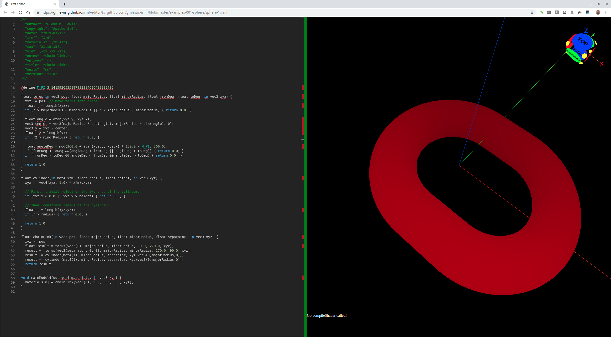

# 014-chain-link

## chain-link-1.irmf

Once we have the torus with start and end parameters, we can make a chain
link out of a couple partial toroids and a couple cylinders:



```glsl
/*{
  irmf: "1.0",
  materials: ["PLA1"],
  max: [21,15,3],
  min: [-15,-15,-3],
  units: "mm",
}*/

#define M_PI 3.1415926535897932384626433832795

float torus(float majorRadius, float minorRadius, float fromDeg, float toDeg, in vec3 xyz) {
  float r = length(xyz);
  if (r > majorRadius + minorRadius || r < majorRadius - minorRadius) { return 0.0; }
  
  float angle = atan(xyz.y, xyz.x);
  vec3 center = vec3(majorRadius * cos(angle), majorRadius * sin(angle), 0);
  vec3 v = xyz - center;
  float r2 = length(v);
  if (r2 > minorRadius) { return 0.0; }
  
  float angleDeg = mod(360.0 + atan(xyz.y, xyz.x) * 180.0 / M_PI, 360.0);
  if (fromDeg < toDeg &&(angleDeg < fromDeg || angleDeg > toDeg)) { return 0.0; }
  if (fromDeg > toDeg && angleDeg < fromDeg && angleDeg > toDeg) { return 0.0; }
  
  return 1.0;
}

float cylinder(float radius, float height, in vec3 xyz) {
  // First, trivial reject on the two ends of the cylinder.
  if (xyz.x < 0.0 || xyz.x > height) { return 0.0; }
  
  // Then, constrain radius of the cylinder:
  float r = length(xyz.yz);
  if (r > radius) { return 0.0; }
  
  return 1.0;
}

float chainLink(float majorRadius, float minorRadius, float separator, in vec3 xyz) {
  float result = torus(majorRadius, minorRadius, 90.0, 270.0, xyz);
  result += torus(vec3(separator, 0, 0), majorRadius, minorRadius, 270.0, 90.0, xyz);
  result += cylinder(minorRadius, separator, xyz - vec3(0, majorRadius, 0));
  result += cylinder(minorRadius, separator, xyz + vec3(0, majorRadius, 0));
  return result;
}

void mainModel4(out vec4 materials, in vec3 xyz) {
  materials[0] = chainLink(9.0, 3.0, 6.0, xyz);
}
```

* Try loading [chain-link-1.irmf](https://gmlewis.github.io/irmf-editor/?s=github.com/gmlewis/irmf/blob/master/examples/014-chain-link/chain-link-1.irmf) now in the experimental IRMF editor!

* Here is a crude STL approximation of this model
  using [irmf-slicer](https://github.com/gmlewis/irmf-slicer):
  - [chain-link-1-mat01-PLA1.stl](chain-link-1-mat01-PLA1.stl) (32548884 bytes)

----------------------------------------------------------------------

# License

Copyright 2019 Glenn M. Lewis. All Rights Reserved.

Licensed under the Apache License, Version 2.0 (the "License");
you may not use this file except in compliance with the License.
You may obtain a copy of the License at

    http://www.apache.org/licenses/LICENSE-2.0

Unless required by applicable law or agreed to in writing, software
distributed under the License is distributed on an "AS IS" BASIS,
WITHOUT WARRANTIES OR CONDITIONS OF ANY KIND, either express or implied.
See the License for the specific language governing permissions and
limitations under the License.
