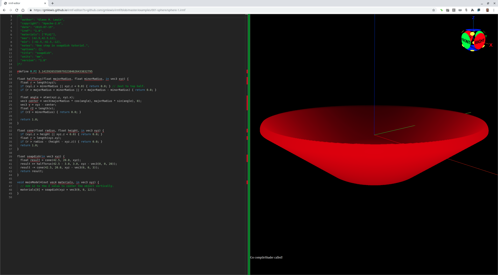

# 014-soapdish

Let's model a soapdish (like [this one](http://www.thingiverse.com/thing:135154) on Thingiverse.com)
in a step-by-step, tutorial fashion.

## soapdish-step-01.irmf

First, the general shape of the soapdish is a squished upside-down cone,
so let's start with a cone that is chopped off by its minimum bounding box.


```glsl
/*{
  irmf: "1.0",
  materials: ["PLA1"],
  max: [42.5,42.5,12],
  min: [-42.5,-42.5,-12],
  units: "mm",
}*/

#define M_PI 3.1415926535897932384626433832795

float cone(float radius, float height, in vec3 xyz) {
  if (xyz.z > height) { return 0.0; }
  float r = length(xyz.xy);
  if (r > radius - (height - xyz.z)) { return 0.0; }
  return 1.0;
}

float soapdish(in vec3 xyz) {
  float result = cone(42.5, 20.0, xyz);
  return result;
}

void mainModel4(out vec4 materials, in vec3 xyz) {
  // Add 12 to the Z value to center the object vertically.
  materials[0] = soapdish(xyz + vec3(0, 0, 12));
}
```

* Try loading [soapdish-step-01.irmf](https://gmlewis.github.io/irmf-editor/?s=github.com/gmlewis/irmf/blob/master/examples/015-soapdish/soapdish-step-01.irmf) now in the experimental IRMF editor!

## soapdish-step-02.irmf

Let's hollow out the dish with another identical cone slide up vertically by
a small amount. But this time, we need to stop the cone at z<0 so that the
base of the dish is solid.


```glsl
/*{
  irmf: "1.0",
  materials: ["PLA1"],
  max: [42.5,42.5,12],
  min: [-42.5,-42.5,-12],
  units: "mm",
}*/

#define M_PI 3.1415926535897932384626433832795

float cone(float radius, float height, in vec3 xyz) {
  if (xyz.z > height || xyz.z < 0.0) { return 0.0; }
  float r = length(xyz.xy);
  if (r > radius - (height - xyz.z)) { return 0.0; }
  return 1.0;
}

float soapdish(in vec3 xyz) {
  float result = cone(42.5, 20.0, xyz);
  result -= cone(42.5, 20.0, xyz - vec3(0, 0, 3));
  return result;
}

void mainModel4(out vec4 materials, in vec3 xyz) {
  // Add 12 to the Z value to center the object vertically.
  materials[0] = soapdish(xyz + vec3(0, 0, 12));
}
```

* Try loading [soapdish-step-02.irmf](https://gmlewis.github.io/irmf-editor/?s=github.com/gmlewis/irmf/blob/master/examples/015-soapdish/soapdish-step-02.irmf) now in the experimental IRMF editor!

## soapdish-step-03.irmf

Let's round the edge of the top of the dish so that it does not have sharp edges.
One way to do this is to add a half-torus (the upper half) to the original cone
before subtracting out the inner cone. That way, it trims the torus along with
the outer cone.



```glsl
/*{
  irmf: "1.0",
  materials: ["PLA1"],
  max: [42.5,42.5,12],
  min: [-42.5,-42.5,-12],
  units: "mm",
}*/

#define M_PI 3.1415926535897932384626433832795

float halfTorus(float majorRadius, float minorRadius, in vec3 xyz) {
  float r = length(xyz);
  if (xyz.z > minorRadius || xyz.z < 0.0) { return 0.0; } // Just to top half.
  if (r > majorRadius + minorRadius || r < majorRadius - minorRadius) { return 0.0; }
  
  float angle = atan(xyz.y, xyz.x);
  vec3 center = vec3(majorRadius * cos(angle), majorRadius * sin(angle), 0);
  vec3 v = xyz - center;
  float r2 = length(v);
  if (r2 > minorRadius) { return 0.0; }
  
  return 1.0;
}

float cone(float radius, float height, in vec3 xyz) {
  if (xyz.z > height || xyz.z < 0.0) { return 0.0; }
  float r = length(xyz.xy);
  if (r > radius - (height - xyz.z)) { return 0.0; }
  return 1.0;
}

float soapdish(in vec3 xyz) {
  float result = cone(42.5, 20.0, xyz);
  result += halfTorus(42.5 - 3.0, 3.0, xyz - vec3(0, 0, 20));
  result -= cone(42.5, 20.0, xyz - vec3(0, 0, 3));
  return result;
}

void mainModel4(out vec4 materials, in vec3 xyz) {
  // Add 12 to the Z value to center the object vertically.
  materials[0] = soapdish(xyz + vec3(0, 0, 12));
}
```

* Try loading [soapdish-step-03.irmf](https://gmlewis.github.io/irmf-editor/?s=github.com/gmlewis/irmf/blob/master/examples/015-soapdish/soapdish-step-03.irmf) now in the experimental IRMF editor!

----------------------------------------------------------------------

# License

Copyright 2019 Glenn M. Lewis. All Rights Reserved.

Licensed under the Apache License, Version 2.0 (the "License");
you may not use this file except in compliance with the License.
You may obtain a copy of the License at

    http://www.apache.org/licenses/LICENSE-2.0

Unless required by applicable law or agreed to in writing, software
distributed under the License is distributed on an "AS IS" BASIS,
WITHOUT WARRANTIES OR CONDITIONS OF ANY KIND, either express or implied.
See the License for the specific language governing permissions and
limitations under the License.
