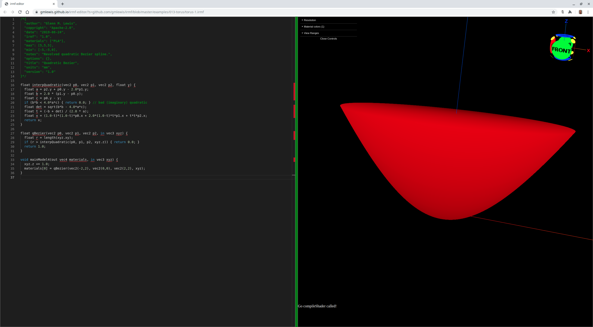
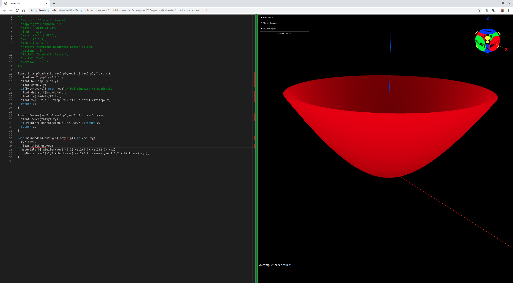

# 020-quadratic-bezier

## quadratic-bezier-1.irmf

It turns out that a quadratic bezier is also relatively easy to model and
demonstrates a smooth curve that STL can not represent well:



```glsl
/*{
  irmf: "1.0",
  materials: ["PLA"],
  max: [5,5,5],
  min: [-5,-5,0],
  units: "mm",
}*/

float interpQuadratic(vec2 p0,vec2 p1,vec2 p2,float y){
  float a=p2.y+p0.y-2.*p1.y;
  float b=2.*(p1.y-p0.y);
  float c=p0.y-y;
  if(b*b<4.*a*c){return 0.;}// bad (imaginary) quadratic
  float det=sqrt(b*b-4.*a*c);
  float t=(-b+det)/(2.*a);
  float x=(1.-t)*(1.-t)*p0.x+2.*(1.-t)*t*p1.x+t*t*p2.x;
  return x;
}

float qBezier(vec2 p0,vec2 p1,vec2 p2,in vec3 xyz){
  float r=length(xyz.xy);
  if(r>interpQuadratic(p0,p1,p2,xyz.z)){return 0.;}
  return 1.;
}

void mainModel4(out vec4 materials,in vec3 xyz){
  xyz.z+=1.;
  materials[0]=qBezier(vec2(-2,2),vec2(0,0),vec2(2,2),xyz);
}
```

* Try loading [quadratic-bezier-1.irmf](https://gmlewis.github.io/irmf-editor/?s=github.com/gmlewis/irmf/blob/master/examples/020-quadratic-bezier/quadratic-bezier-1.irmf) now in the experimental IRMF editor!

* Here is a crude STL approximation of this model
  using [irmf-slicer](https://github.com/gmlewis/irmf-slicer):
  - [quadratic-bezier-1-mat01-PLA.stl](quadratic-bezier-1-mat01-PLA.stl) (9765484 bytes)

## quadratic-bezier-2.irmf

We can hollow out the interior with a second quadratic bezier:



```glsl
/*{
  irmf: "1.0",
  materials: ["PLA"],
  max: [5,5,5],
  min: [-5,-5,0],
  units: "mm",
}*/

float interpQuadratic(vec2 p0,vec2 p1,vec2 p2,float y){
  float a=p2.y+p0.y-2.*p1.y;
  float b=2.*(p1.y-p0.y);
  float c=p0.y-y;
  if(b*b<4.*a*c){return 0.;}// bad (imaginary) quadratic
  float det=sqrt(b*b-4.*a*c);
  float t=(-b+det)/(2.*a);
  float x=(1.-t)*(1.-t)*p0.x+2.*(1.-t)*t*p1.x+t*t*p2.x;
  return x;
}

float qBezier(vec2 p0,vec2 p1,vec2 p2,in vec3 xyz){
  float r=length(xyz.xy);
  if(r>interpQuadratic(p0,p1,p2,xyz.z)){return 0.;}
  return 1.;
}

void mainModel4(out vec4 materials,in vec3 xyz){
  xyz.z+=1.;
  float thickness=.5;
  materials[0]=qBezier(vec2(-2,2),vec2(0,0),vec2(2,2),xyz)-
  qBezier(vec2(-2,2.+thickness),vec2(0,thickness),vec2(2,2.+thickness),xyz);
}
```

* Try loading [quadratic-bezier-2.irmf](https://gmlewis.github.io/irmf-editor/?s=github.com/gmlewis/irmf/blob/master/examples/020-quadratic-bezier/quadratic-bezier-2.irmf) now in the experimental IRMF editor!

* Here is a crude STL approximation of this model
  using [irmf-slicer](https://github.com/gmlewis/irmf-slicer):
  - [quadratic-bezier-2-mat01-PLA.stl](quadratic-bezier-2-mat01-PLA.stl) (13836684 bytes)

----------------------------------------------------------------------

# License

Copyright 2019 Glenn M. Lewis. All Rights Reserved.

Licensed under the Apache License, Version 2.0 (the "License");
you may not use this file except in compliance with the License.
You may obtain a copy of the License at

    http://www.apache.org/licenses/LICENSE-2.0

Unless required by applicable law or agreed to in writing, software
distributed under the License is distributed on an "AS IS" BASIS,
WITHOUT WARRANTIES OR CONDITIONS OF ANY KIND, either express or implied.
See the License for the specific language governing permissions and
limitations under the License.
