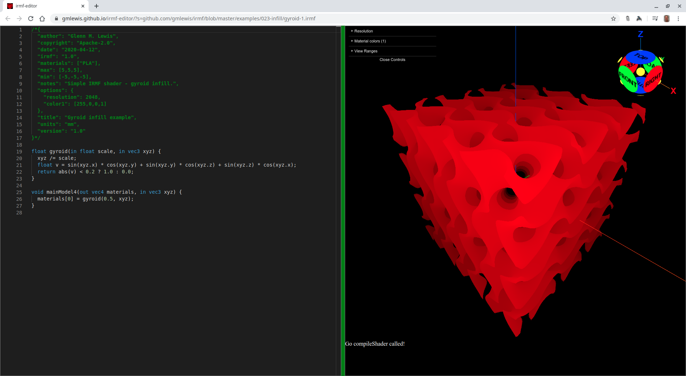

# 023-infill

3D printing infill can also be easily accomplished with an IRMF shader.

## gyroid-1.irmf

This is a gyroid structure as defined on [Wikipedia](https://en.wikipedia.org/wiki/Gyroid):




```glsl
/*{
  irmf: "1.0",
  materials: ["PLA"],
  max: [5,5,5],
  min: [-5,-5,-5],
  units: "mm",
}*/

float gyroid(in float scale, in vec3 xyz) {
  xyz /= scale;
  float v = sin(xyz.x) * cos(xyz.y) + sin(xyz.y) * cos(xyz.z) + sin(xyz.z) * cos(xyz.x);
  return abs(v) < 0.2 ? 1.0 : 0.0;
}

void mainModel4(out vec4 materials, in vec3 xyz) {
  materials[0] = gyroid(0.5, xyz);
}
```

* Try loading [gyroid-1.irmf](https://gmlewis.github.io/irmf-editor/?s=github.com/gmlewis/irmf/blob/master/examples/023-infill/gyroid-1.irmf) now in the experimental IRMF editor!

* Here is a crude STL approximation of this model
  using [irmf-slicer](https://github.com/gmlewis/irmf-slicer):
  - [gyroid-1-mat01-PLA.stl](gyroid-1-mat01-PLA.stl) (48215484 bytes)

* Here is a voxel approximation of this model
  using [irmf-slicer](https://github.com/gmlewis/irmf-slicer):
  - [gyroid-1-mat01-PLA.cbddlp](gyroid-1-mat01-PLA.cbddlp) (6287748 bytes)

----------------------------------------------------------------------

# License

Copyright 2020 Glenn M. Lewis. All Rights Reserved.

Licensed under the Apache License, Version 2.0 (the "License");
you may not use this file except in compliance with the License.
You may obtain a copy of the License at

    http://www.apache.org/licenses/LICENSE-2.0

Unless required by applicable law or agreed to in writing, software
distributed under the License is distributed on an "AS IS" BASIS,
WITHOUT WARRANTIES OR CONDITIONS OF ANY KIND, either express or implied.
See the License for the specific language governing permissions and
limitations under the License.
