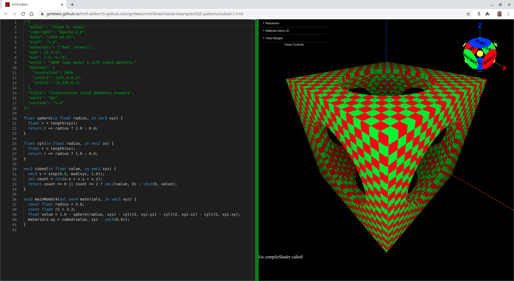
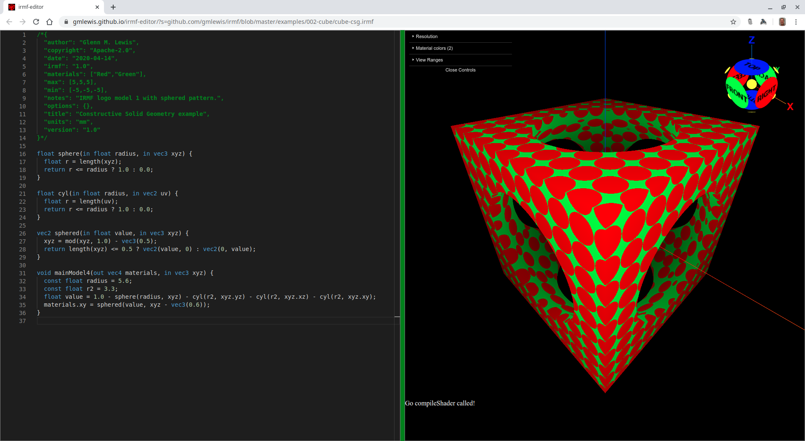

# 025-patterns

Using the [IRMF editor](https://gmlewis.github.io/irmf-editor/), it can be
difficult to see the details in the solid due to it [not using surface
normals](https://github.com/gmlewis/irmf-editor#how-does-it-work).

Adding patterns to the model and displaying more than one color (by using
more than one material) makes it much easier to visualize the solid.

Converting a single-material model to multiple materials involves:

* Adding the material names to the IRMF header
* Splitting the model's material value into multiple values using a pattern
* Assigning the resulting pattern to multiple `material` channels

Below are some simple examples.

## cubed-1.irmf

Here is the [IRMF logo](https://github.com/gmlewis/irmf/tree/master/examples/002-cube#irmf-logo-model-1irmf)
with the cubed pattern applied:



```glsl
/*{
  irmf: "1.0",
  materials: ["Red","Green"],
  max: [5,5,5],
  min: [-5,-5,-5],
  units: "mm",
}*/

float sphere(in float radius, in vec3 xyz) {
  float r = length(xyz);
  return r <= radius ? 1.0 : 0.0;
}

float cyl(in float radius, in vec2 uv) {
  float r = length(uv);
  return r <= radius ? 1.0 : 0.0;
}

vec2 cubed(in float value, in vec3 xyz) {
  vec3 v = step(0.5, mod(xyz, 1.0));
  int count = int(v.x + v.y + v.z);
  return count == 0 || count == 2 ? vec2(value, 0) : vec2(0, value);
}

void mainModel4(out vec4 materials, in vec3 xyz) {
  const float radius = 5.6;
  const float r2 = 3.3;
  float value = 1.0 - sphere(radius, xyz) - cyl(r2, xyz.yz) - cyl(r2, xyz.xz) - cyl(r2, xyz.xy);
  materials.xy = cubed(value, xyz - vec3(0.6));
}
```

* Try loading [cubed-1.irmf](https://gmlewis.github.io/irmf-editor/?s=github.com/gmlewis/irmf/blob/master/examples/025-patterns/cubed-1.irmf) now in the experimental IRMF editor!

## sphered-1.irmf

Here is the [IRMF logo](https://github.com/gmlewis/irmf/tree/master/examples/002-cube#irmf-logo-model-1irmf)
with the sphered pattern applied:



```glsl
/*{
  irmf: "1.0",
  materials: ["Red","Green"],
  max: [5,5,5],
  min: [-5,-5,-5],
  units: "mm",
}*/

float sphere(in float radius, in vec3 xyz) {
  float r = length(xyz);
  return r <= radius ? 1.0 : 0.0;
}

float cyl(in float radius, in vec2 uv) {
  float r = length(uv);
  return r <= radius ? 1.0 : 0.0;
}

vec2 sphered(in float value, in vec3 xyz) {
  xyz = mod(xyz, 1.0) - vec3(0.5);
  return length(xyz) <= 0.5 ? vec2(value, 0) : vec2(0, value);
}

void mainModel4(out vec4 materials, in vec3 xyz) {
  const float radius = 5.6;
  const float r2 = 3.3;
  float value = 1.0 - sphere(radius, xyz) - cyl(r2, xyz.yz) - cyl(r2, xyz.xz) - cyl(r2, xyz.xy);
  materials.xy = sphered(value, xyz - vec3(0.6));
}
```

* Try loading [sphered-1.irmf](https://gmlewis.github.io/irmf-editor/?s=github.com/gmlewis/irmf/blob/master/examples/025-patterns/sphered-1.irmf) now in the experimental IRMF editor!

----------------------------------------------------------------------

# License

Copyright 2020 Glenn M. Lewis. All Rights Reserved.

Licensed under the Apache License, Version 2.0 (the "License");
you may not use this file except in compliance with the License.
You may obtain a copy of the License at

    http://www.apache.org/licenses/LICENSE-2.0

Unless required by applicable law or agreed to in writing, software
distributed under the License is distributed on an "AS IS" BASIS,
WITHOUT WARRANTIES OR CONDITIONS OF ANY KIND, either express or implied.
See the License for the specific language governing permissions and
limitations under the License.
